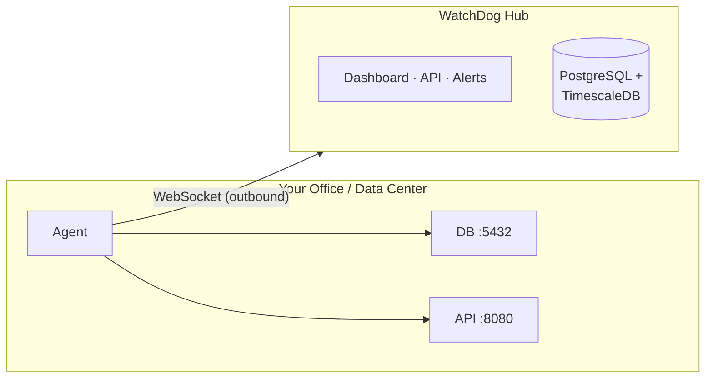
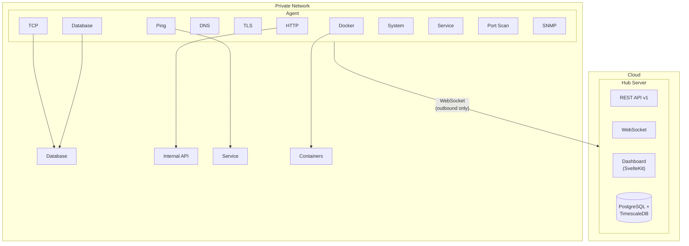

```
██╗    ██╗ █████╗ ████████╗ ██████╗██╗  ██╗██████╗  ██████╗  ██████╗
██║    ██║██╔══██╗╚══██╔══╝██╔════╝██║  ██║██╔══██╗██╔═══██╗██╔════╝
██║ █╗ ██║███████║   ██║   ██║     ███████║██║  ██║██║   ██║██║  ███╗
██║███╗██║██╔══██║   ██║   ██║     ██╔══██║██║  ██║██║   ██║██║   ██║
╚███╔███╔╝██║  ██║   ██║   ╚██████╗██║  ██║██████╔╝╚██████╔╝╚██████╔╝
 ╚══╝╚══╝ ╚═╝  ╚═╝   ╚═╝    ╚═════╝╚═╝  ╚═╝╚═════╝  ╚═════╝  ╚═════╝
```
**The only open-source monitoring tool with native agent-based distributed architecture.**

Monitor services behind firewalls, across data centers, and inside private networks — all from a single dashboard.

> **Live at [usewatchdog.dev](https://usewatchdog.dev)** — Open source. Self-host or sign up for the hosted version.

[](https://github.com/sylvester-francis/Watchdog/stargazers)
[](https://github.com/sylvester-francis/Watchdog/releases)


[Quick Start](#quick-start) · [Features](#features) · [CLI](#cli) · [API](#api) · [Configuration](#configuration) · [Deployment](#deployment)

---

## Why WatchDog?

Most self-hosted monitoring tools (Uptime Kuma, Gatus, Statping) run checks from a single server. If that server can't reach your target, you're blind. WatchDog takes a different approach:

**Deploy lightweight agents inside your networks.** Each agent connects outbound to the Hub over WebSocket — no inbound firewall rules, no VPN tunnels, no port forwarding. The Hub collects results, manages incidents, and sends alerts.


```mermaid
graph LR
    subgraph net["Your Office / Data Center"]
        Agent["Agent"]
        DB["DB :5432"]
        API["API :8080"]
        Agent --> DB
        Agent --> API
    end

    subgraph hub["WatchDog Hub"]
        Dashboard["Dashboard · API · Alerts"]
        PG[("PostgreSQL +\nTimescaleDB")]
    end

    Agent -- "WebSocket (outbound)" --> hub
```

## Features

- **Private Agent Architecture** — Monitor internal databases, APIs, and services without exposing them to the internet
- **Distributed traces & logs (OTLP)** — Native OTLP/HTTP receivers at `/v1/traces` and `/v1/logs`. Any OpenTelemetry collector or SDK can push directly. Built-in trace explorer with waterfall, span detail, and logs correlated by `trace_id`. gzip Content-Encoding accepted. No Tempo, Loki, or Jaeger required.
- **12 Check Types** — HTTP, TCP, Ping, DNS, TLS/SSL certificates, Docker containers, Databases (PostgreSQL, MySQL, Redis), System metrics (CPU, memory, disk), Service monitoring (systemd/Windows services), Port Scanning with service detection, and SNMP device monitoring (v2c/v3)
- **SNMP Device Monitoring** — Monitor network devices with built-in templates for Cisco IOS, HP ProCurve, MikroTik, Ubiquiti, APC UPS, and generic SNMP devices
- **Network Discovery** — Scan IP ranges to discover SNMP-enabled devices with automatic device type detection
- **TLS Certificate Monitoring** — Track certificate expiry, get alerted before certs expire
- **Infrastructure Monitoring** — Docker container health, database connectivity, system resource thresholds
- **Service Monitoring** — Track systemd (Linux) and Windows service state
- **Port Scanning** — Multi-port scanning with banner grabbing and service detection
- **Configurable Failure Threshold** — Default 3 consecutive failures before alerting (configurable 1-10 per monitor), eliminating false positives from transient network issues
- **Incident Lifecycle** — Automatic incident creation, acknowledgment workflow, and resolution with TTR tracking
- **Real-Time Dashboard** — Live status updates via SSE and HTMX, no page refresh needed
- **Public Status Pages** — Create branded status pages with custom slugs for your users
- **Zero-Config Agents** — Agents need only an API key. All monitoring tasks are pushed from the Hub
- **Full REST API (v1)** — Complete CRUD for monitors, agents, and incidents with Bearer token auth
- **CLI Tool** — Manage monitors, agents, and incidents from the command line
- **Interactive API Docs** — Swagger UI at `/docs` with OpenAPI 3.0 spec
- **6 Alert Channels** — Slack, Discord, Email (SMTP), Telegram, PagerDuty, and generic webhooks
- **Security Audit Logging** — All CRUD operations tracked with viewer in System dashboard
- **API Key Scoping** — Admin, read-only, and telemetry-ingest token scopes with IP tracking
- **Agent Fingerprinting** — Device identity verification on connect
- **Brute Force Protection** — Per-IP and per-email login rate limiting with lockout
- **Security Headers** — CSP, X-Frame-Options, HSTS, Permissions-Policy
- **System Dashboard** — Audit log viewer, system health, migration status, runtime config overview

## Comparison

| Feature | WatchDog | Uptime Kuma | Gatus | UptimeRobot |
|---------|----------|-------------|-------|-------------|
| Architecture | Distributed agents | Single server | Single server | SaaS |
| Monitor private networks | Yes (agent runs locally) | Requires VPN/tunnels | Requires VPN/tunnels | No |
| Inbound firewall rules | None needed | Needed for targets | Needed for targets | N/A |
| Check types | 12 (HTTP, TCP, Ping, DNS, TLS, Docker, DB, System, Service, Port Scan, SNMP, Discovery) | HTTP, TCP, Ping, DNS, and more | HTTP, TCP, DNS, SSH, and more | HTTP, Ping, Port |
| Agent configuration | Zero-config (hub pushes tasks) | N/A | Config file | N/A |
| Public status pages | Yes | Yes | Yes | Paid |
| REST API | Yes | Yes | No | Paid |
| Alert channels | 6+ (Slack, Discord, Email, Telegram, PagerDuty, Webhook) | 90+ | 14+ | Email, SMS, Webhook |
| Self-hosted | Yes (AGPL-3.0) | Yes (MIT) | Yes (Apache-2.0) | No |
| Real-time dashboard | Yes (SSE) | Yes (WebSocket) | No | No |

## Architecture


```mermaid
graph TB
    subgraph Cloud
        subgraph Hub["Hub Server"]
            API["REST API v1"]
            WS["WebSocket"]
            Dash["Dashboard<br/>(SvelteKit)"]
            DB[("PostgreSQL +<br/>TimescaleDB")]
        end
    end

    subgraph Net["Private Network"]
        subgraph Agent
            HTTP["HTTP"]
            TCP["TCP"]
            Ping["Ping"]
            DNS["DNS"]
            TLS["TLS"]
            Docker["Docker"]
            DBCheck["Database"]
            Sys["System"]
            Svc["Service"]
            PScan["Port Scan"]
            SNMP["SNMP"]
        end
        T1["Database"]
        T2["Internal API"]
        T3["Service"]
        T4["Containers"]
    end

    Agent -- "WebSocket<br/>(outbound only)" --> Hub
    HTTP --> T2
    TCP --> T1
    Ping --> T3
    Docker --> T4
    DBCheck --> T1
```

The system is split across three repositories:

| Repository | Description | License |
|------------|-------------|---------|
| [watchdog](https://github.com/sylvester-francis/watchdog) (this repo) | Hub server — dashboard, API, alerting, data storage | AGPL-3.0 |
| [watchdog-agent](https://github.com/sylvester-francis/watchdog-agent) | Lightweight monitoring agent binary | MIT |
| [watchdog-proto](https://github.com/sylvester-francis/watchdog-proto) | Shared WebSocket message protocol | MIT |

## Quick Start

### Docker (Recommended)

```bash
git clone https://github.com/sylvester-francis/watchdog.git
cd watchdog
docker compose -f deployments/docker-compose.yml up -d --build
```

The Hub will be available at `http://localhost:8080`. Register an account, create an agent, and connect it.

### From Source

**Prerequisites:** Go 1.25+, Docker, Make

```bash
git clone https://github.com/sylvester-francis/watchdog.git
cd watchdog
make install-tools   # Install dev tools
make docker-db       # Start PostgreSQL + TimescaleDB
make migrate-up      # Run migrations
make dev-hub         # Start hub with hot reload
```

### Connect an Agent

1. Register a user account through the dashboard
2. Create an agent in the dashboard (generates an API key)
3. Install and run the agent:

```bash
curl -sSL https://raw.githubusercontent.com/sylvester-francis/watchdog-agent/main/scripts/install-agent.sh | sudo sh -s -- \
  --api-key YOUR_API_KEY \
  --hub-url wss://usewatchdog.dev/ws/agent
```

See the [watchdog-agent README](https://github.com/sylvester-francis/watchdog-agent) for detailed installation options.

## CLI (deprecated)

> **The standalone CLI is deprecated as of v1.0 and will be removed in v1.2.0.** It hadn't kept pace with the REST API surface (no traces, no logs, no token management, no alert channels). Use the REST API directly — every CLI operation has a one-line `curl` equivalent. See [Scripting with the API](#scripting-with-the-api).

The `cmd/cli/` binary still builds and works in the v1.0.x series, but every invocation prints a deprecation banner to stderr.

If a community-maintained CLI emerges in a separate repo, we'll link it here.

## Scripting with the API

WatchDog exposes a REST API at `/api/v1` for programmatic access. Mint a token in **Settings → API Tokens** (pick the scope appropriate to what your script needs):

| Scope | What it can do |
|-------|----------------|
| `admin` | Full read/write across the API |
| `read_only` | All `GET` endpoints |
| `telemetry_ingest` | Push-only access to `/v1/traces`, `/v1/logs`, `/v1/logs/raw` — for OTel collectors and SDKs |

Then export it once and use plain `curl` + `jq`:

```bash
export WATCHDOG_HUB="https://usewatchdog.dev"
export WATCHDOG_TOKEN="wd_..."
auth() { curl -sH "Authorization: Bearer $WATCHDOG_TOKEN" "$@"; }
```

### Quick health snapshot (replaces `watchdog status`)

```bash
auth "$WATCHDOG_HUB/api/v1/dashboard/stats" | jq
```

### Manage monitors

```bash
# List
auth "$WATCHDOG_HUB/api/v1/monitors" | jq

# Create
auth -X POST "$WATCHDOG_HUB/api/v1/monitors" \
  -H 'Content-Type: application/json' \
  -d '{"name":"API health","type":"http","target":"https://api.example.com/healthz","agent_id":"<uuid>","interval_seconds":30,"timeout_seconds":10}' | jq

# Update
auth -X PUT "$WATCHDOG_HUB/api/v1/monitors/<id>" \
  -H 'Content-Type: application/json' \
  -d '{"interval_seconds":60}' | jq

# SLA report
auth "$WATCHDOG_HUB/api/v1/monitors/<id>/sla" | jq
```

### Query traces & logs

```bash
# List recent traces (last hour, errors only)
SINCE=$(date -u -v-1H +%Y-%m-%dT%H:%M:%SZ)
auth "$WATCHDOG_HUB/api/v1/traces?since=$SINCE&limit=50" \
  | jq '.data[] | select(.has_error)'

# Get a trace's full span tree
auth "$WATCHDOG_HUB/api/v1/traces/<trace_id>" | jq

# Logs correlated to a trace
auth "$WATCHDOG_HUB/api/v1/logs?trace_id=<hex>&limit=100" | jq '.data[].body'

# Page through older traces with the keyset cursor
OLDEST=$(auth "$WATCHDOG_HUB/api/v1/traces?since=$SINCE&limit=200" | jq -r '.data[-1].start_time')
auth "$WATCHDOG_HUB/api/v1/traces?since=$SINCE&before=$OLDEST&limit=200" | jq
```

### Incidents

```bash
# List active incidents
auth "$WATCHDOG_HUB/api/v1/incidents?status=open" | jq

# Investigate (full RCA + timeline + sibling monitors)
auth "$WATCHDOG_HUB/api/v1/incidents/<id>/investigation" | jq

# Acknowledge / resolve
auth -X POST "$WATCHDOG_HUB/api/v1/incidents/<id>/acknowledge"
auth -X POST "$WATCHDOG_HUB/api/v1/incidents/<id>/resolve"
```

### Alert channels & maintenance windows

```bash
# Test a channel (sends a test notification)
auth -X POST "$WATCHDOG_HUB/api/v1/alert-channels/<id>/test"

# Schedule a one-time maintenance window
auth -X POST "$WATCHDOG_HUB/api/v1/maintenance-windows" \
  -H 'Content-Type: application/json' \
  -d '{"agent_id":"<uuid>","name":"DB upgrade","starts_at":"2026-06-01T02:00:00Z","ends_at":"2026-06-01T04:00:00Z","recurrence":"once"}'
```

### OTel collectors

For pushing traces and logs from any OpenTelemetry collector or SDK, point the OTLP exporter at `$WATCHDOG_HUB` with a `telemetry_ingest`-scoped token. The receivers accept gzip-encoded protobuf at `/v1/traces` and `/v1/logs`:

```yaml
exporters:
  otlphttp:
    endpoint: https://usewatchdog.dev
    headers:
      Authorization: "Bearer wd_..."
```

## API

WatchDog exposes a REST API at `/api/v1` for programmatic access. Authenticate with a Bearer token generated from **Settings > API Tokens**.

```bash
# List all monitors
curl -H "Authorization: Bearer wd_a1b2c3..." https://usewatchdog.dev/api/v1/monitors

# Create a monitor
curl -X POST -H "Authorization: Bearer wd_a1b2c3..." -H "Content-Type: application/json" \
  -d '{"name":"My API","type":"http","target":"https://api.example.com","agent_id":"..."}' \
  https://usewatchdog.dev/api/v1/monitors

# Update a monitor
curl -X PUT -H "Authorization: Bearer wd_a1b2c3..." -H "Content-Type: application/json" \
  -d '{"name":"Updated Name"}' \
  https://usewatchdog.dev/api/v1/monitors/{id}

# Delete a monitor
curl -X DELETE -H "Authorization: Bearer wd_a1b2c3..." https://usewatchdog.dev/api/v1/monitors/{id}

# Acknowledge an incident
curl -X POST -H "Authorization: Bearer wd_a1b2c3..." https://usewatchdog.dev/api/v1/incidents/{id}/acknowledge

# Resolve an incident
curl -X POST -H "Authorization: Bearer wd_a1b2c3..." https://usewatchdog.dev/api/v1/incidents/{id}/resolve

# Dashboard stats
curl -H "Authorization: Bearer wd_a1b2c3..." https://usewatchdog.dev/api/v1/dashboard/stats
```

Interactive API documentation is available at `/docs` (Swagger UI).

### API Token Format

Tokens use the format `wd_<32 hex chars>`. Only the SHA-256 hash is stored — the plaintext is shown once at creation and cannot be retrieved. Tokens are scoped (`admin` or `read_only`) and track the last-used IP address.

## Configuration

### Required

| Variable | Description |
|----------|-------------|
| `DATABASE_URL` | PostgreSQL connection string |
| `ENCRYPTION_KEY` | Exactly 32 bytes for AES-256 agent key encryption |
| `SESSION_SECRET` | Session signing key (minimum 32 bytes) |

### Optional

| Variable | Description | Default |
|----------|-------------|---------|
| `SERVER_HOST` | Server bind address | `0.0.0.0` |
| `SERVER_PORT` | Server port | `8080` |
| `SERVER_READ_TIMEOUT` | HTTP read timeout | `15s` |
| `SERVER_WRITE_TIMEOUT` | HTTP write timeout | `15s` |
| `SERVER_IDLE_TIMEOUT` | HTTP idle timeout | `60s` |
| `SERVER_SECURE_COOKIES` | Set Secure flag on session cookies | `false` |
| `ALLOWED_ORIGINS` | Comma-separated WebSocket allowed origins | Server's own host |
| `DATABASE_MAX_CONNS` | Max database connections | `25` |
| `DATABASE_MIN_CONNS` | Min database connections | `5` |

### Alert Channels

| Variable | Description |
|----------|-------------|
| `SLACK_WEBHOOK_URL` | Slack incoming webhook URL |
| `DISCORD_WEBHOOK_URL` | Discord webhook URL |
| `WEBHOOK_URL` | Generic webhook URL |
| `SMTP_HOST` | SMTP server hostname |
| `SMTP_PORT` | SMTP server port (default: `587`) |
| `SMTP_USERNAME` | SMTP auth username |
| `SMTP_PASSWORD` | SMTP auth password |
| `SMTP_FROM` | Sender email address |
| `SMTP_TO` | Recipient email address |
| `TELEGRAM_BOT_TOKEN` | Telegram bot token |
| `TELEGRAM_CHAT_ID` | Telegram chat ID |
| `PAGERDUTY_ROUTING_KEY` | PagerDuty Events API v2 routing key |

## Deployment

### Docker Compose on VPS (Recommended)

The live instance at [usewatchdog.dev](https://usewatchdog.dev) runs on a VPS with Docker Compose + Caddy (auto-SSL).

```bash
# One-time VPS setup (installs Docker, clones repo, generates secrets)
bash scripts/vps-setup.sh

# Deploy (from deployments/ directory)
docker compose -f docker-compose.prod.yml up -d --build
```

The production stack includes Caddy (reverse proxy with automatic HTTPS), PostgreSQL + TimescaleDB, and the Hub.

### Docker Compose (Local / Development)

```bash
# Build and start the full stack (Hub + PostgreSQL + TimescaleDB)
make docker-build
make docker-up

# View logs
make docker-logs

# Stop
make docker-down
```

### Build from Source

```bash
make build          # Build hub + CLI
make build-hub      # Hub only → bin/hub
make build-cli      # CLI only → bin/watchdog
```

### Database Migrations

```bash
make migrate-up       # Apply all pending migrations
make migrate-down     # Rollback the last migration
make migrate-create NAME=add_new_table
```

## Development

```bash
make dev-hub          # Hot reload via Air
make test             # Run tests with race detection
make test-short       # Skip slow tests
make test-e2e         # Run end-to-end tests
make test-coverage    # HTML coverage report
make test-mutation    # Mutation tests with Gremlins
make lint             # golangci-lint
make fmt              # gofmt + goimports
make sec              # gosec security scan
make vuln             # govulncheck
```

## Current Status

WatchDog is in active development. All features are available to all users:

- Up to 10 agents per account
- Unlimited monitors and status pages
- All check types: HTTP, TCP, Ping, DNS, TLS, Docker, Database, System, Service, Port Scan, SNMP, Network Discovery
- All 6 alert channels
- Full REST API access with scoped tokens
- Security audit logging with System dashboard viewer
- Agent fingerprinting for device identity verification

## Tech Stack

| Component | Technology |
|-----------|------------|
| Language | Go 1.25 |
| Web Framework | Echo v4 |
| Database | PostgreSQL 16 + TimescaleDB |
| Frontend | SvelteKit + Tailwind CSS + Chart.js + Lucide Icons |
| Real-Time | WebSockets (agents) + SSE (dashboard) |
| Auth | Argon2id passwords + AES-256-GCM encryption + gorilla/sessions |
| API Auth | SHA-256 hashed Bearer tokens (`wd_` prefix) |
| API Docs | OpenAPI 3.0 + Swagger UI |
| CLI | Pure Go (zero external dependencies) |
| Icons | Lucide |
| Deployment | Docker Compose + Caddy on VPS |

## Related Repositories

| Repository | Description | License |
|------------|-------------|---------|
| [watchdog-agent](https://github.com/sylvester-francis/watchdog-agent) | Lightweight monitoring agent binary | MIT |
| [watchdog-proto](https://github.com/sylvester-francis/watchdog-proto) | Shared WebSocket message protocol | MIT |

## License

The WatchDog Hub is licensed under the [GNU Affero General Public License v3.0](LICENSE) (AGPL-3.0). The agent and protocol repositories are licensed under the MIT License.

