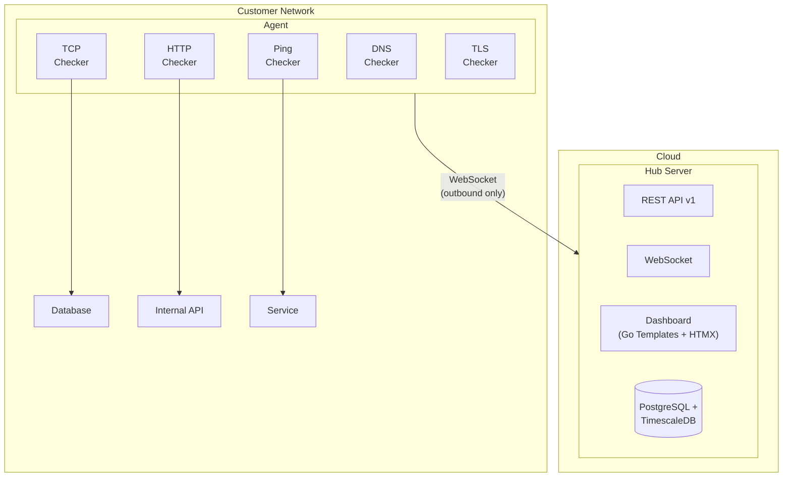

```
██╗    ██╗ █████╗ ████████╗ ██████╗██╗  ██╗██████╗  ██████╗  ██████╗
██║    ██║██╔══██╗╚══██╔══╝██╔════╝██║  ██║██╔══██╗██╔═══██╗██╔════╝
██║ █╗ ██║███████║   ██║   ██║     ███████║██║  ██║██║   ██║██║  ███╗
██║███╗██║██╔══██║   ██║   ██║     ██╔══██║██║  ██║██║   ██║██║   ██║
╚███╔███╔╝██║  ██║   ██║   ╚██████╗██║  ██║██████╔╝╚██████╔╝╚██████╔╝
 ╚══╝╚══╝ ╚═╝  ╚═╝   ╚═╝    ╚═════╝╚═╝  ╚═╝╚═════╝  ╚═════╝  ╚═════╝
```
**The only open-source monitoring tool with native agent-based distributed architecture.**

Monitor services behind firewalls, across data centers, and inside private networks — all from a single dashboard.

> **Live at [usewatchdog.dev](https://usewatchdog.dev)** — Currently in open beta. All features free.


[Quick Start](#quick-start) · [Features](#features) · [CLI](#cli) · [API](#api) · [Configuration](#configuration) · [Deployment](#deployment)

---

## Why WatchDog?

Most self-hosted monitoring tools (Uptime Kuma, Gatus, Statping) run checks from a single server. If that server can't reach your target, you're blind. WatchDog takes a different approach:

**Deploy lightweight agents inside your networks.** Each agent connects outbound to the Hub over WebSocket — no inbound firewall rules, no VPN tunnels, no port forwarding. The Hub collects results, manages incidents, and sends alerts.

```
┌─────────────────────────────┐       ┌──────────────────────────────┐
│  Your Office / Data Center  │       │        WatchDog Hub          │
│                             │       │                              │
│  ┌─────────┐                │       │  Dashboard · API · Alerts    │
│  │  Agent   │───WebSocket──────────▶│  PostgreSQL + TimescaleDB    │
│  └────┬─────┘   (outbound)  │       │                              │
│       │                     │       └──────────────────────────────┘
│  ┌────▼────┐  ┌──────────┐  │
│  │ DB:5432 │  │ API:8080 │  │
│  └─────────┘  └──────────┘  │
└─────────────────────────────┘
```

## Features

- **Private Agent Architecture** — Monitor internal databases, APIs, and services without exposing them to the internet
- **5 Check Types** — HTTP, TCP, Ping, DNS, and TLS/SSL certificate monitoring
- **TLS Certificate Monitoring** — Track certificate expiry, get alerted before certs expire
- **3-Strike Rule** — Verifies failures before alerting, eliminating false positives from transient network issues
- **Incident Lifecycle** — Automatic incident creation, acknowledgment workflow, and resolution with TTR tracking
- **Real-Time Dashboard** — Live status updates via SSE and HTMX, no page refresh needed
- **Public Status Pages** — Create branded status pages with custom slugs for your users
- **Zero-Config Agents** — Agents need only an API key. All monitoring tasks are pushed from the Hub
- **Full REST API (v1)** — Complete CRUD for monitors, agents, and incidents with Bearer token auth
- **CLI Tool** — Manage monitors, agents, and incidents from the command line
- **Interactive API Docs** — Swagger UI at `/docs` with OpenAPI 3.0 spec
- **6 Alert Channels** — Slack, Discord, Email (SMTP), Telegram, PagerDuty, and generic webhooks
- **Security Audit Logging** — Track all authentication and resource changes
- **Brute Force Protection** — Per-IP and per-email login rate limiting with lockout
- **Security Headers** — HSTS, CSP (no unsafe-eval), Permissions-Policy, and more
- **Admin Panel** — User management, plan assignment, and system overview

## Architecture



The system is split across three repositories:

| Repository | Description | License |
|------------|-------------|---------|
| [watchdog](https://github.com/sylvester-francis/watchdog) (this repo) | Hub server — dashboard, API, alerting, data storage | AGPL-3.0 |
| [watchdog-agent](https://github.com/sylvester-francis/watchdog-agent) | Lightweight monitoring agent binary | MIT |
| [watchdog-proto](https://github.com/sylvester-francis/watchdog-proto) | Shared WebSocket message protocol | MIT |

## Quick Start

**Prerequisites:** Go 1.25+, Docker, Make

```bash
# Clone the repository
git clone https://github.com/sylvester-francis/watchdog.git
cd watchdog

# Install development tools
make install-tools

# Start the database
make docker-db

# Run database migrations
make migrate-up

# Start the Hub (with hot reload)
make dev-hub
```

The Hub will be available at `http://localhost:8080`.

### Connect an Agent

1. Register a user account through the dashboard
2. Create an agent in the dashboard (generates an API key)
3. Install and run the agent:

```bash
curl -sSL https://raw.githubusercontent.com/sylvester-francis/watchdog-agent/main/scripts/install-agent.sh | sudo sh -s -- \
  --api-key YOUR_API_KEY \
  --hub-url wss://usewatchdog.dev/ws/agent
```

See the [watchdog-agent README](https://github.com/sylvester-francis/watchdog-agent) for detailed installation options.

## CLI

WatchDog includes a CLI tool for managing your monitors, agents, and incidents from the terminal.

```bash
# Build the CLI
make build-cli

# Login to your hub
./bin/watchdog login

# List monitors
./bin/watchdog monitors list

# Create a monitor
./bin/watchdog monitors create --name "API Health" --type http --target https://api.example.com/health --agent-id <uuid>

# List agents
./bin/watchdog agents list

# View incidents
./bin/watchdog incidents list

# Get a quick status overview
./bin/watchdog status

# JSON output for scripting
./bin/watchdog monitors list --json
```

## API

WatchDog exposes a REST API at `/api/v1` for programmatic access. Authenticate with a Bearer token generated from **Settings > API Tokens**.

```bash
# List all monitors
curl -H "Authorization: Bearer wd_a1b2c3..." https://usewatchdog.dev/api/v1/monitors

# Create a monitor
curl -X POST -H "Authorization: Bearer wd_a1b2c3..." -H "Content-Type: application/json" \
  -d '{"name":"My API","type":"http","target":"https://api.example.com","agent_id":"..."}' \
  https://usewatchdog.dev/api/v1/monitors

# Update a monitor
curl -X PUT -H "Authorization: Bearer wd_a1b2c3..." -H "Content-Type: application/json" \
  -d '{"name":"Updated Name"}' \
  https://usewatchdog.dev/api/v1/monitors/{id}

# Delete a monitor
curl -X DELETE -H "Authorization: Bearer wd_a1b2c3..." https://usewatchdog.dev/api/v1/monitors/{id}

# Acknowledge an incident
curl -X POST -H "Authorization: Bearer wd_a1b2c3..." https://usewatchdog.dev/api/v1/incidents/{id}/acknowledge

# Resolve an incident
curl -X POST -H "Authorization: Bearer wd_a1b2c3..." https://usewatchdog.dev/api/v1/incidents/{id}/resolve

# Dashboard stats
curl -H "Authorization: Bearer wd_a1b2c3..." https://usewatchdog.dev/api/v1/dashboard/stats
```

Interactive API documentation is available at `/docs` (Swagger UI).

### API Token Format

Tokens use the format `wd_<32 hex chars>`. Only the SHA-256 hash is stored — the plaintext is shown once at creation and cannot be retrieved.

## Configuration

### Required

| Variable | Description |
|----------|-------------|
| `DATABASE_URL` | PostgreSQL connection string |
| `ENCRYPTION_KEY` | Exactly 32 bytes for AES-256 agent key encryption |
| `SESSION_SECRET` | Session signing key (minimum 32 bytes) |

### Optional

| Variable | Description | Default |
|----------|-------------|---------|
| `SERVER_HOST` | Server bind address | `0.0.0.0` |
| `SERVER_PORT` | Server port | `8080` |
| `SERVER_READ_TIMEOUT` | HTTP read timeout | `15s` |
| `SERVER_WRITE_TIMEOUT` | HTTP write timeout | `15s` |
| `SERVER_IDLE_TIMEOUT` | HTTP idle timeout | `60s` |
| `SERVER_SECURE_COOKIES` | Set Secure flag on session cookies | `false` |
| `ALLOWED_ORIGINS` | Comma-separated WebSocket allowed origins | Server's own host |
| `DATABASE_MAX_CONNS` | Max database connections | `25` |
| `DATABASE_MIN_CONNS` | Min database connections | `5` |

### Alert Channels

| Variable | Description |
|----------|-------------|
| `SLACK_WEBHOOK_URL` | Slack incoming webhook URL |
| `DISCORD_WEBHOOK_URL` | Discord webhook URL |
| `WEBHOOK_URL` | Generic webhook URL |
| `SMTP_HOST` | SMTP server hostname |
| `SMTP_PORT` | SMTP server port (default: `587`) |
| `SMTP_USERNAME` | SMTP auth username |
| `SMTP_PASSWORD` | SMTP auth password |
| `SMTP_FROM` | Sender email address |
| `SMTP_TO` | Recipient email address |
| `TELEGRAM_BOT_TOKEN` | Telegram bot token |
| `TELEGRAM_CHAT_ID` | Telegram chat ID |
| `PAGERDUTY_ROUTING_KEY` | PagerDuty Events API v2 routing key |

## Deployment

### Railway (Recommended)

The Hub is deployed on [Railway](https://railway.app) at [usewatchdog.dev](https://usewatchdog.dev). To deploy your own instance:

1. Fork this repository
2. Create a new Railway project and connect your fork
3. Add a **PostgreSQL** service (Railway provides managed Postgres with TimescaleDB)
4. Set the required environment variables (`DATABASE_URL`, `ENCRYPTION_KEY`, `SESSION_SECRET`)
5. Railway auto-detects the `railway.toml` and builds using the Dockerfile

The included `railway.toml` configures the build and health check:

```toml
[build]
builder = "DOCKERFILE"
dockerfilePath = "deployments/Dockerfile.hub"

[deploy]
startCommand = "/app/hub"
healthcheckPath = "/health"
```

### Docker Compose (Self-Hosted)

```bash
# Build and start the full stack (Hub + PostgreSQL + TimescaleDB)
make docker-build
make docker-up

# View logs
make docker-logs

# Stop
make docker-down
```

### Build from Source

```bash
make build          # Build hub + CLI
make build-hub      # Hub only → bin/hub
make build-cli      # CLI only → bin/watchdog
```

### Database Migrations

```bash
make migrate-up       # Apply all pending migrations
make migrate-down     # Rollback the last migration
make migrate-create NAME=add_new_table
```

## Development

```bash
make dev-hub          # Hot reload via Air
make test             # Run tests with race detection
make test-short       # Skip slow tests
make test-e2e         # Run end-to-end tests
make test-coverage    # HTML coverage report
make test-mutation    # Mutation tests with Gremlins
make lint             # golangci-lint
make fmt              # gofmt + goimports
make sec              # gosec security scan
make vuln             # govulncheck
```

## Beta Plan

WatchDog is currently in beta. All users get the full feature set for free:

| | Beta (Current) |
|---|---|
| Agents | 10 |
| Monitors | Unlimited |
| Check Types | HTTP, TCP, Ping, DNS, TLS |
| Alert Channels | All 6 |
| Status Pages | Unlimited |
| API Access | Full CRUD |
| Price | **Free** |

## Tech Stack

| Component | Technology |
|-----------|------------|
| Language | Go 1.25 |
| Web Framework | Echo v4 |
| Database | PostgreSQL 16 + TimescaleDB |
| Frontend | Go Templates + HTMX + Alpine.js + TailwindCSS |
| Real-Time | WebSockets (agents) + SSE (dashboard) |
| Auth | Argon2id passwords + AES-256-GCM encryption + gorilla/sessions |
| API Auth | SHA-256 hashed Bearer tokens (`wd_` prefix) |
| API Docs | OpenAPI 3.0 + Swagger UI |
| CLI | Pure Go (zero external dependencies) |
| Icons | Lucide |
| Deployment | Railway, Docker + Docker Compose |

## Related Repositories

| Repository | Description | License |
|------------|-------------|---------|
| [watchdog-agent](https://github.com/sylvester-francis/watchdog-agent) | Lightweight monitoring agent binary | MIT |
| [watchdog-proto](https://github.com/sylvester-francis/watchdog-proto) | Shared WebSocket message protocol | MIT |

## License

The WatchDog Hub is licensed under the [GNU Affero General Public License v3.0](LICENSE) (AGPL-3.0). The agent and protocol repositories are licensed under the MIT License.
